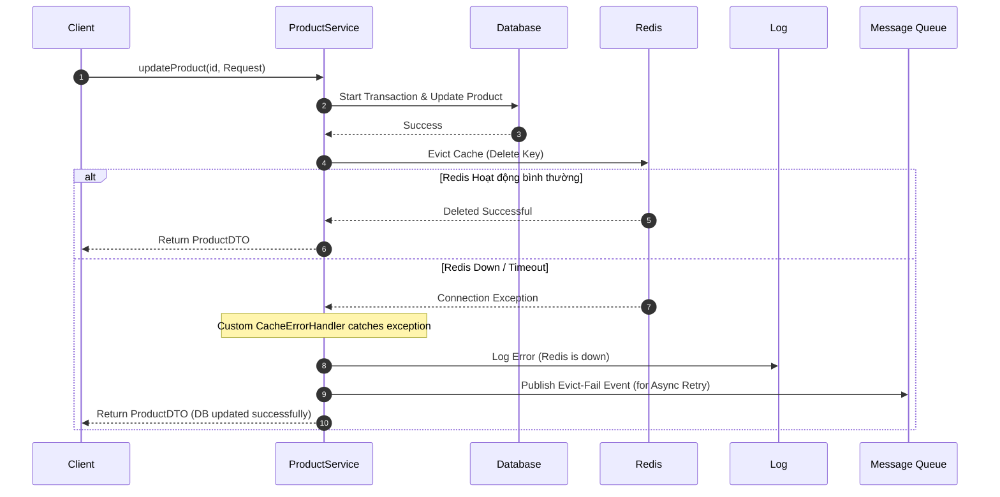

# BÁO CÁO PHÂN TÍCH: CHIẾN LƯỢC CẬP NHẬT CACHE - @CachePut hay @CacheEvict? (Hệ thống Thương mại Điện tử 100:1)

## 1. Phân tích yêu cầu Input/Output cho thao tác cập nhật sản phẩm

- **Đầu vào (Input)**:
  - `productId` (Long/String): Mã định danh duy nhất của sản phẩm cần cập nhật.
  - `UpdateProductRequest` (DTO): Chứa các thông tin cần cập nhật như tên, giá, số lượng tồn kho, mô tả. Có validation chặt chẽ (ví dụ: giá không được âm, tên không được trống).
- **Đầu ra (Output)**:
  - `ProductDTO` (DTO): Chứa thông tin sản phẩm sau khi đã cập nhật thành công (đồng bộ cả dưới DB và Cache).

---

## 2. So sánh hai chiến lược @CachePut và @CacheEvict

### Cơ chế hoạt động
- **@CachePut (Ghi đè - Update Cache)**: Sau khi phương thức cập nhật DB hoàn tất thành công, Spring Cache sẽ lấy kết quả trả về của phương thức ghi đè trực tiếp vào Cache với key tương ứng. Các request đọc sau đó sẽ nhận ngay giá trị mới từ Cache mà không cần gọi xuống DB.
- **@CacheEvict (Xóa - Invalid Cache)**: Sau khi phương thức cập nhật DB hoàn tất thành công, Spring Cache sẽ tiến hành xóa key tương ứng trong Cache. Lượt đọc tiếp theo sẽ gặp tình trạng Cache Miss, kích hoạt câu lệnh lấy dữ liệu mới nhất từ DB và nạp lại vào Cache.

### Bảng so sánh chi tiết

| Tiêu chí | Chiến lược @CachePut (Ghi đè) | Chiến lược @CacheEvict (Xóa) |
| :--- | :--- | :--- |
| **Nguy cơ Race Condition (Ghi song song)** | **Rất cao**.<br>Ví dụ: T1 và T2 cùng update. T1 ghi DB trước, T2 ghi DB sau. Nhưng do network delay, T1 ghi đè cache sau T2. <br>→ **Hậu quả**: DB lưu giá trị của T2 nhưng Cache lưu giá trị lỗi thời của T1. | **Rất thấp**.<br>Cả T1 và T2 đều thực hiện xóa Cache sau khi update DB. Cache luôn ở trạng thái trống và sẽ được nạp lại dữ liệu mới nhất từ DB ở lượt đọc kế tiếp. |
| **Độ phức tạp của code** | **Phức tạp hơn**.<br>Phương thức cập nhật bắt buộc phải trả về đối tượng sản phẩm đầy đủ (`ProductDTO` hoặc `Product`) khớp hoàn toàn với cấu trúc lưu trong Cache. | **Đơn giản**.<br>Phương thức cập nhật chỉ cần xóa cache theo key (`productId`). Hàm cập nhật có thể trả về `void` hoặc bất kỳ kết quả nào. |
| **Nhất quán dữ liệu (Consistency)** | Yếu hơn do nguy cơ Race Condition khi ghi đồng thời cao. | Cao hơn. Cache bị xóa hoàn toàn nên tránh được trạng thái dữ liệu cũ (stale data). |
| **Hiệu năng (Response Time) cho lượt đọc đầu** | **Tối ưu tuyệt đối** (0ms DB roundtrip). Lượt đọc đầu tiên ngay sau khi ghi nhận được kết quả từ cache ngay lập tức. | **Chậm hơn ở lượt đọc đầu tiên** sau update do gặp Cache Miss và phải truy vấn DB để nạp lại cache. |
| **Tải trọng DB (Database Load)** | Thấp hơn vì giảm tối đa Cache Miss. | Có thể tăng nhẹ cục bộ khi có Cache Miss, nhưng với tỉ lệ đọc/ghi 100:1 thì ảnh hưởng này không đáng kể. |

---

## 3. Lựa chọn giải pháp phù hợp và giải thích

### Lựa chọn chiến lược: **@CacheEvict (Xóa Cache)**

### Lý do lựa chọn:
1. **Khắc phục triệt để Race Condition**: Đối với hệ thống thương mại điện tử lớn, việc cập nhật giá hoặc số lượng tồn kho diễn ra liên tục bởi nhiều luồng (hoặc nhiều instance). Việc dùng `@CacheEvict` đảm bảo tính nhất quán (Consistency) cao hơn rất nhiều so với `@CachePut` nhờ loại bỏ rủi ro ghi đè đè chéo dữ liệu cũ.
2. **Tỉ lệ Đọc/Ghi cực kỳ lý tưởng (100:1)**: 
   - Cứ 100 lượt đọc mới có 1 lượt ghi. Nghĩa là tần suất ghi rất thấp.
   - Nếu dùng `@CacheEvict`, việc chấp nhận 1 lần Cache Miss duy nhất sau khi cập nhật để nạp lại cache không gây ảnh hưởng lớn đến tổng thể hiệu năng của hệ thống.
   - Nếu dùng `@CachePut`, ta tốn tài nguyên CPU và bộ nhớ để serialize/deserialize và lưu trữ sản phẩm vào Cache ngay lập tức, trong khi có thể sản phẩm đó sau đó không được đọc tới nhiều (đặc biệt là với các sản phẩm ít hot).
3. **Cấu trúc dữ liệu trả về linh hoạt**: Hàm cập nhật sản phẩm có thể chỉ trả về một thông báo thành công hoặc số dòng ảnh hưởng, không bắt buộc phải load lại toàn bộ Object lên để `@CachePut` lưu trữ.

### Thiết kế luồng xử lý lỗi khi thao tác xóa Cache thất bại (Redis Down, Timeout)

Nếu Redis bị sập (down) hoặc kết nối bị timeout khi thực hiện `@CacheEvict`, luồng xử lý mặc định của Spring Boot sẽ ném ra ngoại lệ và làm rollback toàn bộ Transaction cập nhật sản phẩm trong Database. Điều này cực kỳ nguy hiểm vì DB hoạt động bình thường nhưng Client vẫn nhận lỗi 500.

**Giải pháp thiết kế luồng xử lý lỗi (Fault Tolerance Flow):**
1. **Sử dụng Custom CacheErrorHandler**: Cấu hình để khi có lỗi kết nối Redis, ứng dụng chỉ ghi nhận log `ERROR` nhưng không ném Exception ra ngoài. Hệ thống vẫn cho phép luồng ghi DB thành công (chấp nhận chạy bypass không dùng cache tạm thời).
2. **Cấu hình TTL (Time-To-Live)** ngắn hợp lý cho Cache (ví dụ: 10 - 30 phút) để nếu xảy ra lỗi không evict được, cache cũng tự động hết hạn và đồng bộ lại.
3. **Sử dụng Cơ chế Retry & Message Queue (Cho dữ liệu cực kỳ quan trọng)**: 
   - Khi Evict thất bại, bắn một event "Evict Cache Fail" vào Message Queue (RabbitMQ/Kafka) với cơ chế retry (exponential backoff) để tiến hành xóa lại cache bất đồng bộ sau đó.



---

## 4. Cấu trúc thư mục mã nguồn
```text
src/main/java/com/example/ecommerce/
├── config/
│   └── CacheConfig.java
├── controller/
│   └── ProductController.java
├── dto/
│   ├── ProductDTO.java
│   └── UpdateProductRequest.java
├── entity/
│   └── Product.java
├── exception/
│   ├── GlobalExceptionHandler.java
│   └── ResourceNotFoundException.class
├── repository/
│   └── ProductRepository.java
└── service/
    └── ProductService.java
```